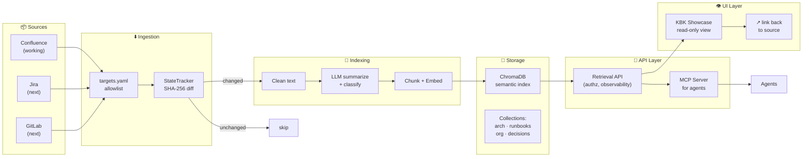

# ADR-0001: v0.3 — MemoryBank as a demonstrable Knowledge Layer

## Status

Proposed · 2026-05-14 · Revised after GLM-5.1 + Kimi K2.6 review

## Context

KBK v0.2 works: Confluence → sync → index → ChromaDB → MCP + Showcase. The pipeline is built, tested (18/18 ATM gates), and documented. But it has a critical gap: **it's not demonstrable to stakeholders**.

Current problems:
- The architecture is correct but invisible. There's no "before/after" that a non-engineer can see in 2 minutes.
- Collections exist as a field on chunks but aren't surfaced as a navigation concept.
- The MCP server works but there's no polished agent→answer→source trail.
- Jira and GitLab are in the roadmap but have zero demo presence.
- The human Showcase exists but isn't designed as a presentation tool.

## Decision

Build v0.3 as a **demonstrable knowledge loop** — not more features, but a presentable story.

## Architecture



**Key changes from original v0.3 proposal:** MemoryBank layer collapsed into Storage + API. The retrieval gateway owns authz, observability, and access control — not the MCP server directly.

## What's New in v0.3 vs v0.2

| Capability | v0.2 | v0.3 |
|-----------|------|------|
| Confluence connector | ✅ working | ✅ polished demo |
| Jira connector | ❌ planned | 📐 contract defined |
| GitLab connector | ❌ planned | 📐 contract defined |
| Collections | ⬜ field on chunk | ✅ first-class navigation |
| MCP tools | search_knowledge, get_document_summary | + list_collections |
| Authz at retrieval | ❌ allowlist only at ingest | ✅ access_group enforced at query |
| Observability | ❌ | ✅ trace IDs across layers |
| Human Showcase | exists | ✅ demo-ready, source-linked |
| Agent→answer→source trail | ❌ | ✅ demo scenario |
| 5-minute stakeholder demo | ❌ | ✅ scripted (3 tracks) |

## AuthZ Model

**Ingestion-time:** `access_group` from targets.yaml propagates to each chunk as metadata.

**Retrieval-time:** The API layer enforces: if agent/user lacks `access_group` for a chunk, it's excluded from results. The MCP server authenticates the caller and passes their group membership.

This prevents the "HR salaries" leakage scenario without implementing a full ACL matrix in v0.3.

## Observability

Each retrieval request carries a trace ID that spans:
```
agent request → API gateway → ChromaDB query → chunk → source URL
```

If an agent retrieves a bad chunk, operators trace it back to the Confluence page, chunk, and embedding model version.

## Demo Requirements

Every block must have a 2-minute demo path. But the full demo is trimmed from 9 minutes to **5 minutes (3 tracks)**:

### Track 1: Why should I care? (2 min)
```text
1. Show the Showcase — collections, summaries, source links
2. Ask an agent a question — it answers with sources
3. "This is the knowledge loop. Let me show you how it works."
```

### Track 2: How does it work? (2 min — pre-recorded)
```text
Play pre-recorded video:
1. Confluence page → kbk sync → index → appears in search
2. Page edited → kbk sync → only changed doc re-indexed
3. Agent calls search_knowledge → gets summary + source
```

### Track 3: What's next? (1 min)
```text
1. "Confluence works today."
2. "Jira and GitLab follow the same pipeline — connector contract is defined."
3. "Still reading your docs? Here's where we're heading."
```

**Why pre-record Track 2:** Live change propagation and agent retrieval are the most failure-prone parts. A pre-recorded demo never fails. The presenter narrates over it.

## Boundaries

**v0.3 is NOT about:**
- Replacing Confluence/Jira/GitLab
- Building an enterprise search engine
- Full multi-source parity (Jira/GitLab are contract-only)
- Custom embedding model training
- Real-time sync (webhooks are post-v0.3)

## Consequences

**Good:**
- Stakeholders see value without reading code
- AuthZ at ingestion + retrieval prevents data leakage
- Trace IDs make debugging possible
- 5-min demo fits any presentation slot

**Risks:**
- ChromaDB may not scale to millions of vectors (acknowledged — Indexing layer abstracts the DB, swappable to Pinecone/Qdrant later)
- Confluence chunking needs metadata enrichment (page title, space key) to avoid precision loss
- MCP ecosystem is new — agents that don't support MCP need a REST bridge

## Decision Drivers

1. Stakeholder demo readiness (highest priority)
2. AuthZ at retrieval (enterprise requirement)
3. Agent retrieval with source citation
4. Collection-based navigation
5. Observability for debugging
6. Clear multi-source roadmap

## Rejected Alternatives

1. **Build Jira connector first** — would take weeks, no demo value until complete
2. **Replace ChromaDB with Qdrant/Milvus** — infrastructure change with zero visible impact
3. **Real-time sync via webhooks** — complex, undemoable, deferred to v0.4
4. **Separate MemoryBank abstraction** — collapsed into Storage + API after review feedback

## Phases

| Phase | Focus | Demo |
|-------|-------|------|
| P1 | Stabilize Confluence baseline | Source→Index |
| P2 | Collections + curated slices | List, scope, navigate |
| P3 | AuthZ at retrieval | Access-group query |
| P4 | MCP + observability | Trace agent→source |
| P5 | Human Showcase polish | Non-engineer demo |
| P6 | End-to-end demo story | 5-minute walkthrough |
