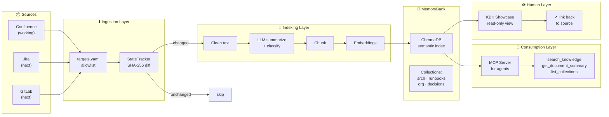

# ADR-0001: v0.3 — MemoryBank as a demonstrable Knowledge Layer

## Status

Proposed · 2026-05-14

## Context

KBK v0.2 works: Confluence → sync → index → ChromaDB → MCP + Showcase. The pipeline is built, tested (18/18 ATM gates), and documented. But it has a critical gap: **it's not demonstrable to stakeholders**.

Current problems:
- The architecture is correct but invisible. There's no "before/after" that a non-engineer can see in 2 minutes.
- Collections exist as a field on chunks but aren't surfaced as a navigation concept.
- The MCP server works but there's no polished agent→answer→source trail.
- Jira and GitLab are in the roadmap but have zero demo presence.
- The human Showcase exists but isn't designed as a presentation tool.

## Decision

Build v0.3 as a **demonstrable knowledge loop** — not more features, but a presentable story:

1. **Sources** → 2. **Sync** → 3. **Index** → 4. **MemoryBank** → 5. **Consumption** → 6. **Showcase**

Every block must have a 2-minute demo path.

## Architecture



## What's New in v0.3 vs v0.2

| Capability | v0.2 | v0.3 |
|-----------|------|------|
| Confluence connector | ✅ working | ✅ polished demo |
| Jira connector | ❌ planned | 📐 contract defined |
| GitLab connector | ❌ planned | 📐 contract defined |
| Collections | ⬜ field on chunk | ✅ first-class navigation |
| MCP tools | search_knowledge, get_document_summary | + list_collections |
| Human Showcase | exists | ✅ demo-ready, source-linked |
| Agent→answer→source trail | ❌ | ✅ demo scenario |
| 5-minute stakeholder demo | ❌ | ✅ scripted |

## Demo Requirements

Every block in the architecture must have a visible demo:

### 1. Source-to-Index (2 min)
```text
1. Show a Confluence page
2. Run `kbk sync` — see it detected as "changed"
3. Run `kbk status` — see document count increase
4. Show the summary + tags
```

### 2. Change Propagation (1 min)
```text
1. Edit the Confluence page
2. Run `kbk sync --dry-run` — cost preview, 1 document changed
3. Run `kbk sync` — only the changed doc re-indexed
4. Show updated summary
```

### 3. Agent MCP Retrieval (2 min)
```text
1. Agent calls `search_knowledge("how to deploy payment service")`
2. Returns: summary + source URL + collection
3. Agent calls `get_document_summary(url)` — detailed context
4. Agent answers with source citation
```

### 4. Collections Navigation (1 min)
```text
1. `list_collections` returns: arch, runbooks, org, decisions
2. `search_knowledge(q, collection="runbooks")` — scoped result
3. Showcase shows knowledge organized, not flat
```

### 5. Human Showcase (2 min)
```text
1. Open the Showcase page
2. See collections as expandable sections
3. Click a document → see summary + tags
4. Click source link → original Confluence page
```

### 6. Roadmap Demo (1 min)
```text
1. "This is Confluence — working today"
2. "Jira and GitLab follow the same pipeline"
3. Show the connector contract
```

## Total Demo Time: 9 minutes

Each block is independent. You can show any 3 in a 5-minute slot.

## Boundaries

**v0.3 is NOT about:**
- Replacing Confluence/Jira/GitLab
- Building an enterprise search engine
- Full multi-source parity (Jira/GitLab are contract-only)
- Complex ACL models

**The rule:** if a capability can't be demoed in 2 minutes, it doesn't go into v0.3.

## Consequences

**Good:**
- Stakeholders see value without reading code
- Collections make the index navigable, not a black box
- Agent→source trail proves the system works
- Each demo block is independently useful

**Risks:**
- Demo-focus may tempt shortcuts in non-demo paths
- Jira/GitLab connectors risk being perpetually "next"
- Showcase needs maintenance to stay in sync

## Decision Drivers

1. Stakeholder demo readiness (highest priority)
2. Agent retrieval with source citation
3. Collection-based knowledge navigation
4. Human-readable knowledge view
5. Clear roadmap for multi-source expansion

## Rejected Alternatives

1. **Build Jira connector first** — would take weeks, no demo value until complete
2. **Replace ChromaDB with Qdrant/Milvus** — infrastructure change with zero visible impact
3. **Full ACL implementation** — important but undemoable; deferred to v0.4

## Phases

| Phase | Focus | Demo |
|-------|-------|------|
| P1 | Stabilize Confluence baseline | Source→Index |
| P2 | Collections + curated slices | List, scope, navigate |
| P3 | Connector contract | Roadmap clarity |
| P4 | MCP-first agent patterns | Agent→answer→source |
| P5 | Human Showcase polish | Non-engineer demo |
| P6 | End-to-end demo story | 9-minute full walkthrough |
